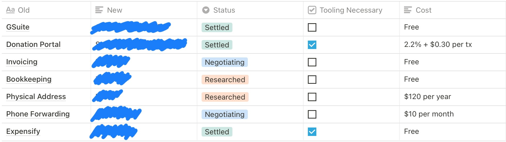
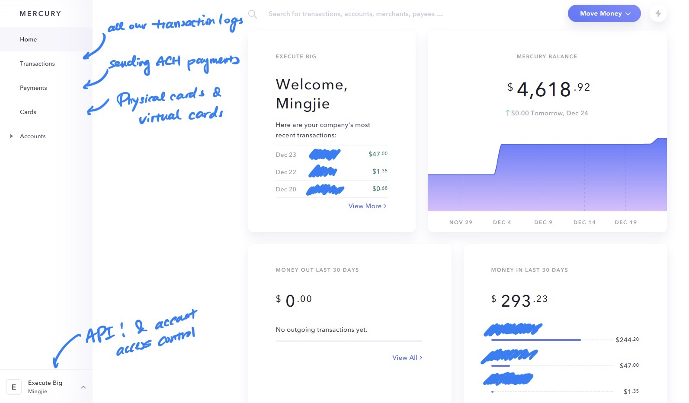
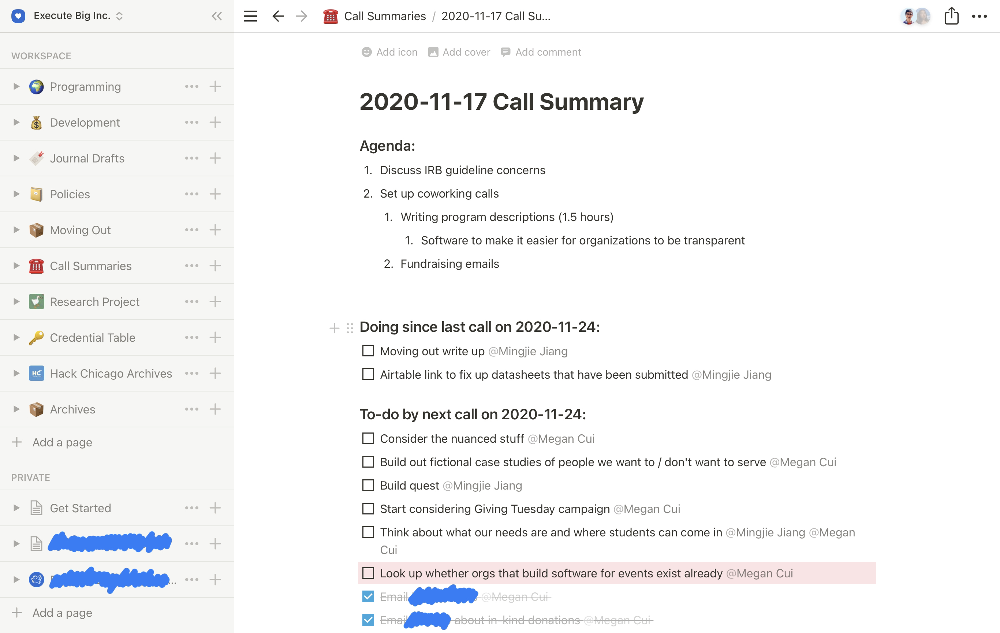

Execute Big was founded over a year ago under a fiscal sponsor, and one year later, we decided to become an independent nonprofit organization for legal and marketing independence. We’ve come a long way, and while we are not currently able to do much under the pandemic, we believe that there are still tons of potential for us to grow.

More recently, I received quite a few questions from fellow student leaders about founding their own nonprofit organizations, and through this journal, I hope to be able to answer these questions about entity-forming, and the decision-making process that of.



# A Headstart

I cannot explain how much we appreciate the existence of fiscal sponsors to help new founders – especially students – launch projects, especially now that we have gone through the legal process of founding an entity. **We recommend all student founders to start as a fiscally sponsored entity** — either through Hack Club Bank or other registered fiscal sponsors. It costs you virtually nothing (your fiscal sponsor will usually take only 7-15% of your revenue for their platform, and there’s no monthly fee in most cases, so if your idea doesn’t work out, there’s no cost to you), and you’ll have a headstart to test your ideas and pilot your programs.

Don’t worry about creating your own legal entity until you have a solid year of operations and a stable source of revenue to power your programs — pilot what you are trying to do, find your first sponsors, and plan out the future of your programs.

# Planning

## Thinking It Through

Sit down with your co-founders and make sure you’re completely settled on the idea of moving out. Do not rush that conversation — once you’re out there on your own, there will be no backups. That is:

- If you are an event, and one of your sponsors delayed their payment to your bank, nobody will be able to front that money for you, so you’ll have to front that out of your own pocket;
- You’ll have to find your own banking provider, and most banks are not exactly tailored to new nonprofits;
- All the services that you might have been taking for granted from your fiscal sponsor will no longer be there, and you’ll have to figure these out by yourself: a reimbursement process, pre-built donation pages, pre-configured Google Workspace setups…

For us, we created a table of services that we depend on at Hack Club Bank and listed all the potential alternatives that we may be able to switch to after we move out. Also, do some research on costs — software platforms are not cheap, but a lot of companies may provide discounts for nonprofits.

## Setting Things Up

You’ll likely need a physical address somewhere in your home state as the business address of your organization. You can apply for a P.O. Box at your local post office (note that you may not be able to use the P.O. Box address as your principal business address on legal documents), or you can rent a virtual mailbox. Either option will cost you around $120 per year.

We also made sure that we had a contact to answer questions or bounce ideas off of — this can be someone who has previously gone through the process before or perhaps an accountant/lawyer who understands the process.

# Getting Registered

There are multiple levels of registration that you'll have to go through to set yourself up as a functioning public charity.

## Incorporating in a State

First, your organization will need to get incorporated in one of the states. We chose Maryland because that is where I am physically based (at least for this year), and it’ll be easier for us to get our filings in. Most states will require you to have a “registered agent” that resides within the state, but that person can usually be anyone — as long as they are always there to receive any legal documents. However, different states will have different filing requirements, and you should look up the specific filing requirements of your state by referencing the website of your state’s Secretary of State.

You’re usually registering something that looks like “Non-stock Corporation” or “Not-for-Profit Corporation”, which means you and your co-founders may not benefit from the assets of your company. In Maryland, the registration fee was $223, which includes the base filing fee of $170, a mandatory $50 expedition fee, plus a $3 eCheck charge. Other states' filing charges will vary.

## Applying for Tax Exempt Status

The next step is to apply for a federal tax exemption status. If you are starting a publicly-funded nonprofit organization, you are very likely going to apply to be a tax-exempt organization under IRS Section 501(c)(3). A smaller organization like yours may also be eligible to file with Form 1023-EZ, which is faster, cheaper, and requires less information than the full Form 1023. To determine your eligibility and file, you should complete the [Form 1023-EZ Eligibility Worksheet](https://www.irs.gov/instructions/i1023ez#en_US_201709_publink10006530:~:text=earlier.-,Form%201023%2DEZ%20Eligibility%20Worksheet).

It should also be noted that according to the IRS website, "organizations with annual gross revenue below $5,000" are exempt from filing Form 1023. However, that also means that you will not receive a formal federal tax-exemption status.

Prior to filing form 1023/1023-EZ, we also did a full run-through of everything that we have. Your organization should have written bylaws, articles of incorporation, and other organizing documents (if you have no idea how to prepare these documents, you should consult a professional). You should also consider writing a formal mission statement for your organization. Make sure your mission statement is specific! For example, this is our mission statement:

> _We remove barriers to entry into technology to enable all students, with a focus on underrepresented demographics, to experience and explore computer science education by building CS education programs and providing grants for students in need._

It will cost you $275 to file for Form 1023-EZ, and the turnaround time is approximately a few months if everything goes well (we filed at the end of July and received our hard-copy determination letter in late October). If, for some reason, you are going to file for Form 1023 instead, your cost would be $600, and the turnaround will likely take over a year.

### Total Registration Cost

| Item                                        | Recurring? | Cost        | Varies |
| ------------------------------------------- | ---------- | ----------- | ------ |
| Articles of Incorporation                   | No         | $223.00     | Yes    |
| Certified Copy of Articles of Incorporation | No         | $43.26      | Yes    |
| IRS 1023-EZ                                 | No         | $275.00     | No     |
| Virtual Mailbox / P.O. Box                  | Yes (Year) | $120.00     | Yes    |
| **Total**                                   |            | **$661.26** |        |

Again, this amount may vary depending on where you are filing.

# Getting Up and Running

Once you receive the determination letter from the IRS, you're ready to go! This section will showcase some of the things that we are currently using to make Execute Big work.

## Finances: Mercury + Stripe

We use [Mercury](https://mercury.com) as our banking platform. There are a lot of traditional banks out there, but almost all of them have very specific requirements on small business checking accounts. In many cases, we would either need to maintain a minimum balance or have to pay a flat monthly fee to open an account. A few examples:

| Bank            | Type                               | Fee    | Monthly Min | Daily Min | Transaction Limit |
| --------------- | ---------------------------------- | ------ | ----------- | --------- | ----------------- |
| Bank of America | Business Fundamentals®             | $15/mo | $5,000      | $3,000    | 200 + $.45/extra  |
| Wells Fargo     | Initiate Business Checking         | $10/mo | $1,000      | $500      | 100 + $.50/extra  |
| Capital One     | Spark Business Basic Checking®     | $15/mo | $2,000      | -         | -                 |
| Citi            | CitiBusiness® Streamlined Checking | $15/mo | $5,000      | -         | $250              |
| PNC             | Business Checking                  | $10/mo | $500        | -         | 150 + $.50/extra  |

If you don't think you'll meet any of the fee-waiving requirements for these traditional banks, I highly recommend that you look into more modern solutions like Mercury (not sponsored). Here's a screenshot of our Mercury dashboard, along with some annotations on its features. It is completely free, and although you don't earn interest, there are practically no limits to what you can do with your cash. 

We use Stripe to handle payments like donations. Stripe usually charges a 2.9% + 30¢ fee for each transaction, but as a nonprofit, you will likely be eligible for a fee reduction.

## Other Considerations

At this moment, Execute Big is completely functional. But there are still a few more things to consider:

1. **Legal filing**: You will need to make sure your organization is in good standing with the state and the IRS, which requires you to file legal documents and reports annually. You will also be required to register with every state that you plan to publicly solicit in.

2. **Reimbursement**: Software like Expensify can be expensive for a small organization, but you can always handle it manually. Make sure to maintain a standard procedure in reporting these expenses (and as always, keep your receipts).

3. **Be transparent**: This is a personal ask — as a publicly-funded charity, you should always hold yourself accountable for how you are using your money. We made Execute Big ad [transparent](/transparency) as possible, and we hope you’ll join this movement as well.

4. **Learn as you go**: We didn’t know anything about the legal process of starting our own nonprofit when we started, and we learned everything that we’re sharing today through our own experiences. This is a great opportunity for you to learn how the systems within the government works (and if you are younger, you’ll also learn a lot about taxes).

# Conclusion

If you’ve decided to become an independent organization, that means you have grown quite a bit during your trial operations. Ride that momentum wave, but remember to keep the organization (and yourself) in check! At Execute Big, we take notes during every call to note our progress each week and set expectations for the next.

But if you haven’t moved out yet, don’t rush it! With great power comes great responsibility. You will have to handle a lot more things that you would not have to worry about as a subsidiary of a parent organization, and in early stages of your initiative, you would really want to focus your efforts on building great programs and creating impact for your communities without having to worry about the legal and logistical shenanigans.

Whether you are currently running as a fiscally sponsored organization or you’ve already moved out, we’re excited to see your work impact the communities and causes you care about. Best of luck!

---
### Acknowledgements

_Special thanks to our friends Joy and Rick for supporting us during this process, and the Chaleb at Hack Club Bank for being so helpful._

_If you have improvement suggestions or corrections regarding the content of this journal, please [contact us](/contact)! We will not be able to answer questions about the process itself due to capacity limits._