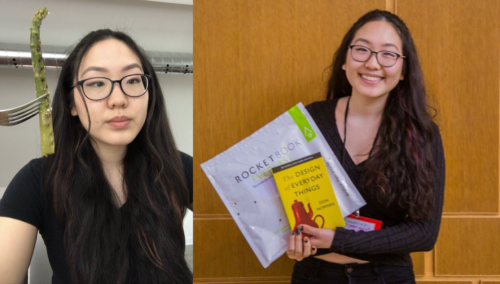
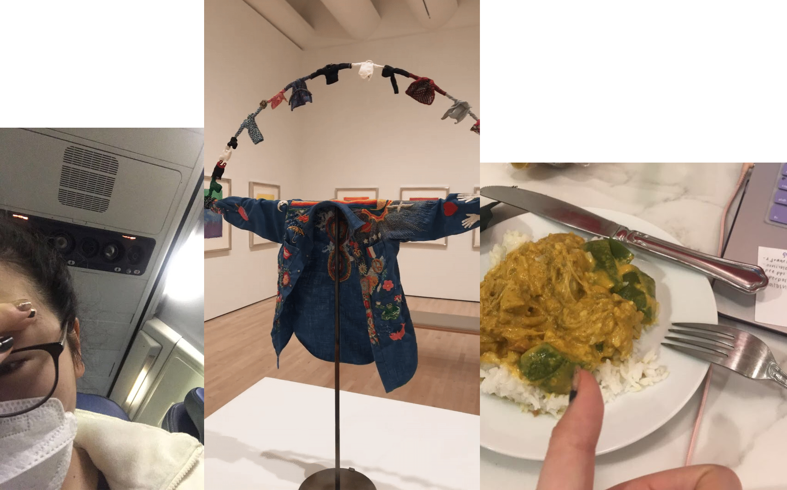
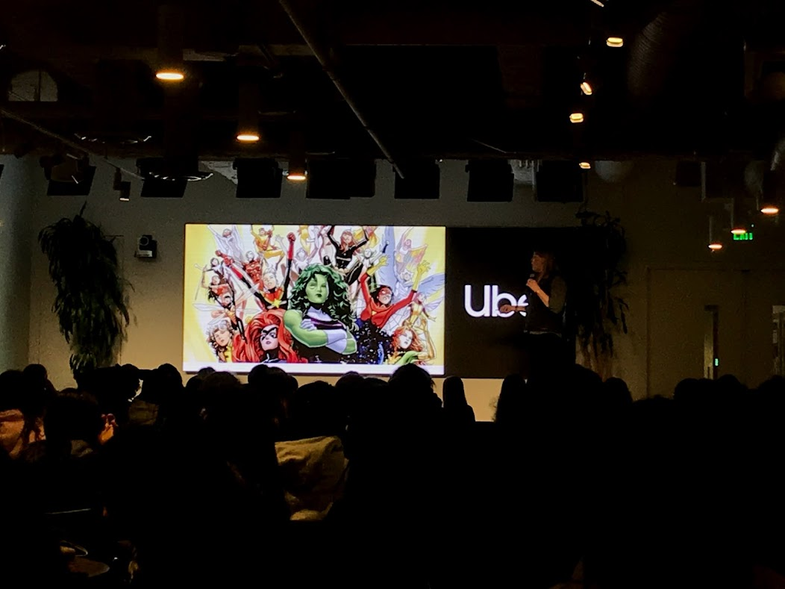
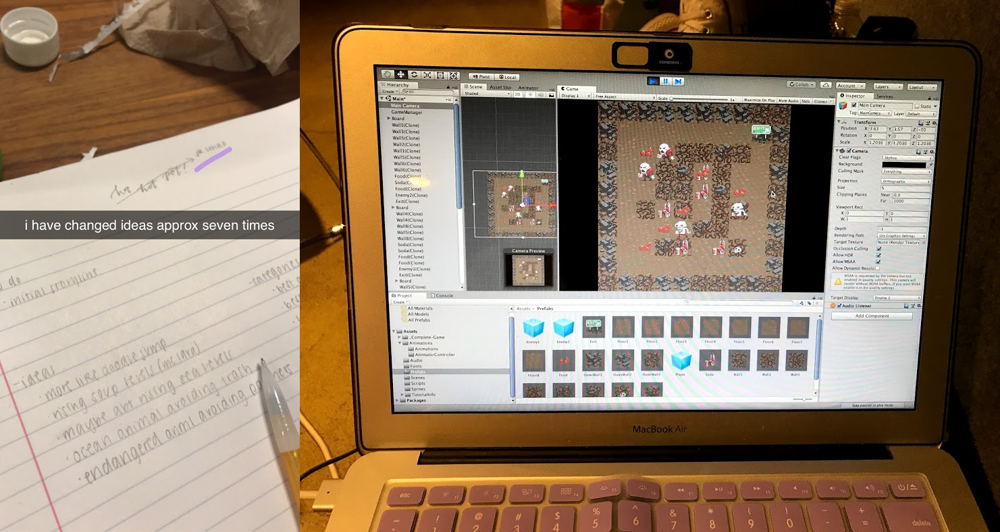
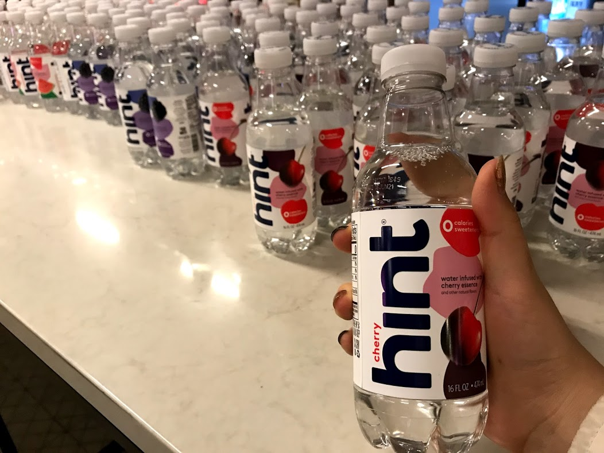
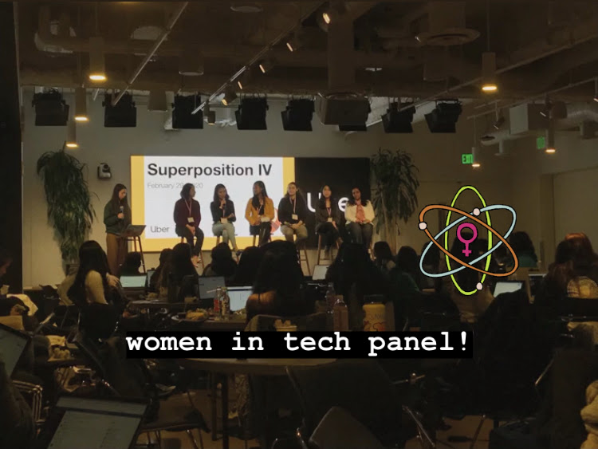
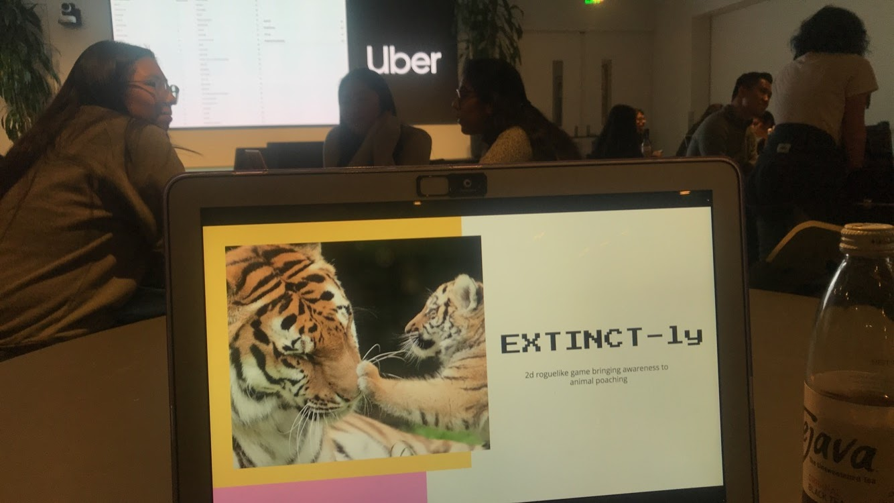
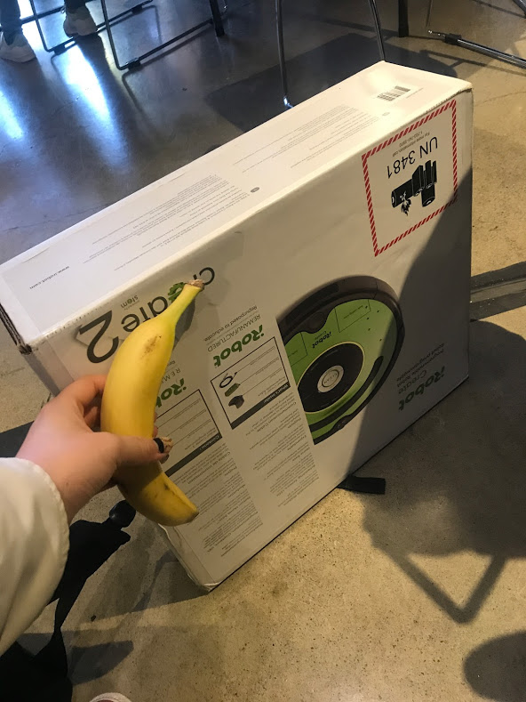
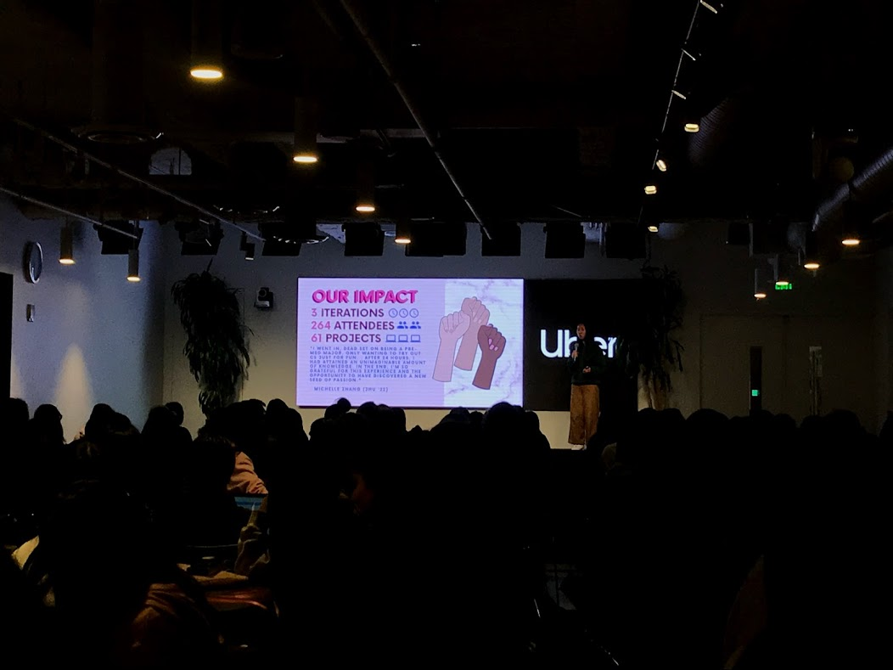

Hi all, I hope you’re doing well (and social distancing)! I’m Gabrielle Chang, a high school senior from Hinsdale, Illinois. Next year I'll (most likely) be pursuing a degree in computer science from Caltech. Outside of school, I'm passionate about environmental activism, iOS app development, and Minecraft. Feel free to ask me about any of those- as my name might suggest, I can be gabby when talking about topics I care about!

In the midst of this COVID-19 crisis, I think it’s worthwhile to practice gratitude for all the good things in our lives. Although there is some uncertainty in the present (Will we have a graduation? What about prom?), I’ve found reflecting on all the amazing past experiences I’ve had and whatever possibilities the future holds has helped keep me grounded and a little more calm. 

One thing I’m especially thankful for was the opportunity to attend the fourth iteration of Superposition earlier this month with a travel grant from Execute Big. This event, Superposition, is the largest 24-hour hackathon for female-identifying and non-binary high school and college students in the Bay Area, and was held at the Uber HQ in San Francisco. 

I first heard of Superposition through an Instagram story from one of its organizers. Immediately I was interested. Although I’ve attended many hackathons in the past, I’ve found that all-female hackathons always have a more inclusive environment I can “vibe” with stronger. A single line of code can touch millions of people, which is why those creating the technology should be as diverse as those who will use it. Superposition's goal of disrupting the coding culture is vital to developing the tools that technology is capable of. Plus, hackathons are a ton of fun and by-nature a great way for anyone to learn fast- no matter your starting skill level. 

So, on the morning of February 28th, I caught a flight to San Francisco, approximately 1846 miles away from home. Luckily, that Friday was a teacher institute day at my school, so after some painful navigating (public transportation is not my forte), I was able to spend a day roaming the MoMA, Pier 39, and other Bay Area attractions. That night, I stayed in a shared hotel room with three strangers- definitely a new experience. 

By 10AM the next day, I had walked to the Uber HQ, where I was ushered by friendly volunteers to the event area to check in. Immediately, I was impressed by how well-organized and professional the entire was. The “hacking” space was spotless, and lined with ample power strips. The kitchen area was thoughtfully stocked with snacks for every dietary restriction. The sponsor swag was lined up neatly for participants to pick up. Organizers and volunteers were everywhere, constantly circling the space to make sure everything was OK. 

After a helpful opening ceremony, it was time to begin. After some consideration, I thought the category I’d aim towards would be “Best Solo Hack”. Although I usually love meeting strangers and having a group of teammates, this was sort of a personal challenge to see if I could rely on myself to build a project. Ultimately, I created a game, EXTINCTly, which you can read more about [here](https://devpost.com/software/extinctly). 

The process to make this game was far from linear. At first, I constantly switched ideas, and went back and forth between creating a mobile app or a game. Plus, at the time I was unfamiliar with C#, and knew almost nothing about Unity. Eventually I settled on my final idea: a game where users play as an elephant trying to survive amidst poachers in order to bring awareness to the issue of animal poaching. I’ll spare all the nitty gritty details, but I tried a lot of new things during this hackathon. 

Throughout the event, I found it super easy to make new friends. Although many girls I met lived in completely different areas, we all shared common interests that made conversation easy- whether it be food, fashion, or whatever. Even though everyone was working hard on their individual projects, at times the event almost felt like a sleepover with friends. One of my favorite moments was when some of the Superposition organizers set up a makeshift ramen “shop” at 2AM, serving instant noodles to anyone who “ordered”- definitely Michelin-star-level stuff. 

Another highlight was the Women in Tech panel. The panelists were all so sweet and truly came from diverse backgrounds. One panelist, Priscilla Wang, is not only Miss New York, but also the founder of a nonprofit “Girls Talk Tech”. Another, Karina Popovich, is not only a Cornell freshman, but also the CEO of a clothing line. They talked about everything from chasing dream internships to non-cliche advice to deal with imposter syndrome. 

After a long night of hacking, it was time to be judged. I pitched to two Uber engineers who were gracious enough to give some quick advice before moving on to the next project. I thought that the judging environment was very healthy and not hyper-competitive like at other hackathons. Instead of focusing on just code, everyone celebrated the failures, bugs, and sleeplessness that came with it. The judges I presented to were probably most impressed with the fact that I didn’t have much Unity experience before this event, and handled problems as they arose. 

Although I don’t remember the flight back home very well (post-hackathon sleep really hits different), Superposition was definitely a memorable experience I won’t forget. After the hackathon ended, I found it easy to stay in touch with everyone that I met. The Superposition social media pages were frequently updated with post-hackathon opportunities, highlights, and thank-you’s. Most recently, I’ve been using some of the time at home to add more features to the game I created at Superposition and clean up some code. 

In all, I’m so glad I had the opportunity to attend Superposition. It was probably one of the most carefully planned hackathons I’ve ever attended, and I will definitely be back next year. Cheers!

