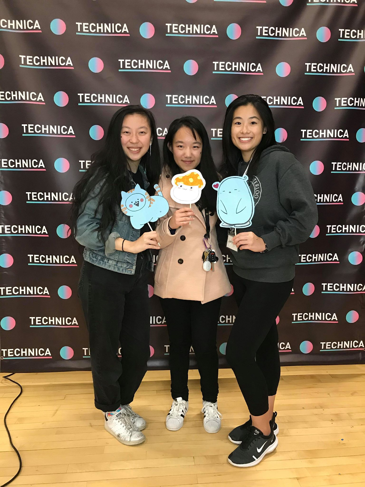

Hey there! I’m Justina Chua, a high school senior from Vernon Hills, Illinois. I’m passionate about technology and computer science education. I lead Hack Club at school, run programs for younger students in my community, organize GirlCon (a Chicago-based technology conference), and serve as a Tech Together Boston Ambassador. I also compete in programming competitions, build enterprise code for State Farm, and dabble in side projects; I’m currently working on a digital wellbeing app!

I attended my first hackathon, Windy City Hacks, in June and fell in love with hackathon culture. There’s something magical about an event that brings together developers from around the nation — you’re surrounded by people with different skill sets and interests, united by a passion to create for good. Everyone’s friendly — attendees, mentors, and organizers alike — so it’s the ideal place to learn new things with 24/7 support from others. Since hackathons impose hard deadlines to submit your projects by, there’s pressure to build a minimum viable product in a short span of time. Procrastination isn’t an option, which forces you to go out of your comfort zone, learn quickly, and immediately utilize what you’ve learned. Despite being sleep-deprived and overly-caffeinated, hackathons are an experience like no other. You’ll create friendships and tech in a welcoming, beginner-friendly community. Did I mention there’s free food and swag?

I applied to Technica on a whim after a friend told me about it. The world’s largest all-female and non-binary hackathon, it seemed like the ideal next step to take: I wanted to experience a hackathon that embraced a more inclusive community and was of a larger-scale with 800+ hackers.

On November 9th, at 3 am, I headed to the airport to catch my flight to Baltimore, Maryland and arrived at the University of Maryland later in the morning. When I entered Reckord Armory, the venue, I was blown away. For the weekend, the sports complex was transformed into a place for hacking and building. Sponsor tables lined three walls, while Technica, MLH, and snack tables lined the remaining one. With the exception of a few male volunteers, I found myself surrounded by young women from around the United States and even the world. It was fascinating to witness and join such a diverse gathering.

There, I met up with Bhavana, Hana, and Srirashmi — two Kode With Klossy scholars and a Kode With Klossy TA. Prior to the hackathon, we decided to combat food insecurity and food waste by connecting donors to those in need. After settling in, we brainstormed ideas. Did we want to build an iOS or web app? How did we want to split up the work? What prizes will we apply to? How should we split up our time to complete our project before the deadline? After settling with the name “Secure the Bread” and writing ideas on Sticky Notes, we took a lap around the sponsor tables. I talked to fascinating individuals, from Software Engineers to UI/UX Designers to FinTech Developers at companies as large as Microsoft or as small as FN, an audio tech start-up. Through these discussions, I learned about various scholarships, fellowships, and internships; although these opportunities were mostly limited to college students, they gave me ideas for what I’d want to pursue in a few years. After receiving more swag than we can hold — stickers, pins, notebooks, t-shirts, you name it — we returned to our table and went straight to coding. From small steps like creating our logo to implementing a Google Maps API, we made sure to involve the entire group in decision-making and discussion. Our openness and eagerness in communication led us to work effectively throughout the event.

During this time, I met up with Cindy, a UMD student and friend of mine from She++, a fellowship program. We caught up since last seeing each other in April, FaceTimed two other fellows, and discussed Secure the Bread! I also befriended girls sitting at the table next to ours — another KWK scholar, PennApps winner, and Florida college student — who were working on a financial literacy game for college students.

Unfortunately, my team didn’t get to attend any workshops because we preferred to spend that time working on our project. Throughout the night, aside from amusing side conversations and off-topic debates, we worked as diligently as possible. Although the front-end wasn’t too difficult since we all had experience with website development, we struggled with working with APIs and worked with mentors to solve our issues and help guide us through the implementation. After many visits to Stack Overflow and time spent on troubleshooting, we took a much-needed break. Technica hosted an array of fun late-night activities, from succulent planting to galaxy painting, but we chose to participate in cake cutting in celebration of Technica’s fifth anniversary and a few other food-related (of course) activities.

I met up with Cindy and Jessica, another She++ ambassador who flew in from the Bay Area. After updating each other on our busy lives, taking photo booth pictures, and learning about 3D printing from a UMD CS booth, we returned to our places.

My team and I slept at 4 am and woke up at 7 am. Knowing this was the last stretch, we put finishing touches on our project: we made sure it ran perfectly, finalized our Github repository, and submitted it on Devpost. From there, we practiced our pitch and grabbed breakfast.

Fast forward to demos. My group passionately pitched Secure the Bread to organizers, sponsors, and even attendees. We demoed our web/iOS platform and how we used Google Maps and Google Cloud APIs utilizing data from the Johns Hopkins Center for a Livable Future to map poverty, food insecurity, and other statistics. Despite our main setback of not being able to implement the APIs to our platform, we were still able to display both on separate laptops. To conclude our pitch, we talked about our personal experiences with witnessing food insecurity — from the streets of Chicago to stories from friends in college — and how we aimed to expand and improve the project in the future. To our surprise, we got the opportunity to pitch to Karlie Kloss, the founder of Kode with Klossy, and Brendan Iribe, the co-founder of Oculus. They congratulated us on our project and Karlie featured us on her Instagram to show her platform what KWK scholars were accomplishing!

At the closing ceremony, we won Best Use of Open Data and Best Hack For Small Businesses, and were awarded by Coding it Forward and VistaPrint, respectively. We were incredibly happy with our accomplishments and were proud of the challenging work we completed in less than 24 hours.

My experience at Technica happened with the help of Execute Big, who funded part of my travel to and from the hackathon. Throughout the entire process, Mingjie, one of the Co-Founders, was incredibly helpful and provided so much guidance in finding transportation, navigating the DC Metro system, and improving the overall hackathon experience. I’m thankful for this experience, and have already told a few friends to apply to the Travel Grant to fund their hackathon adventures. I’m excited to see where this organization goes and can’t wait to see it continue impacting students! Ad astra!
