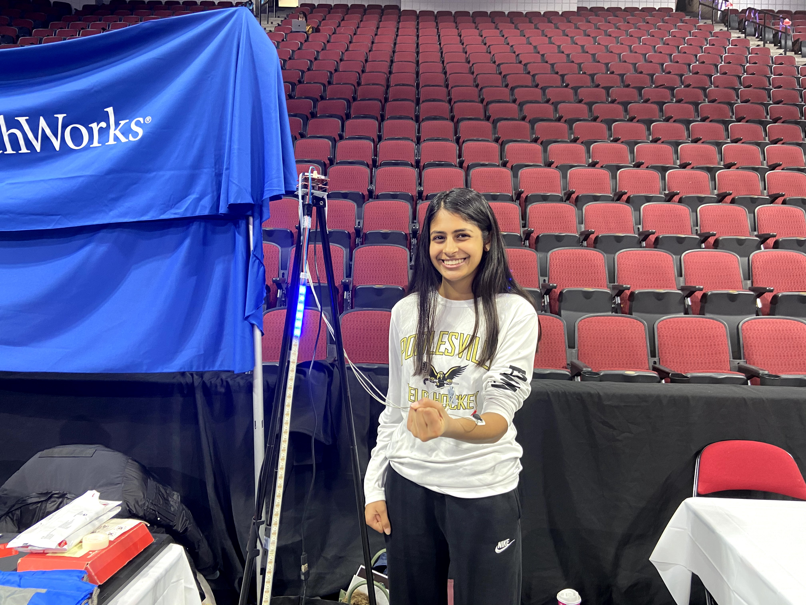
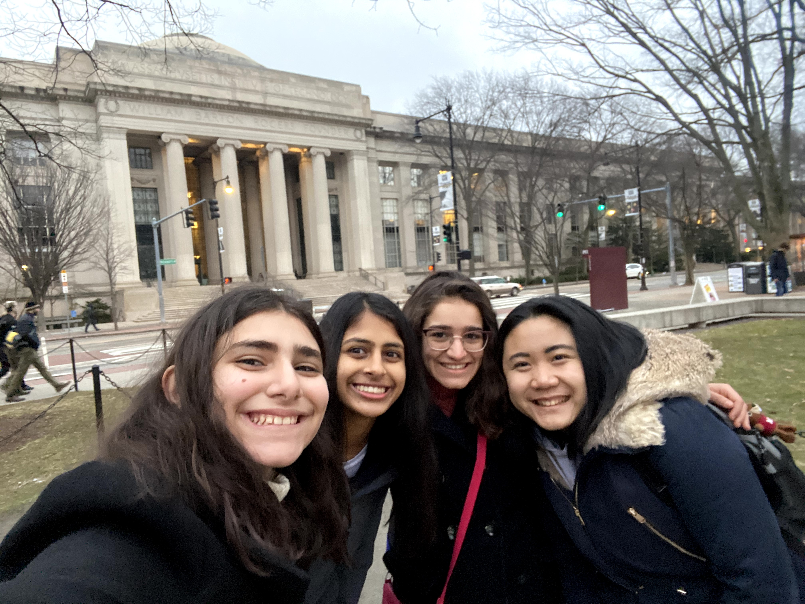

Hi! My name is Priya Kalra and I am a junior in the magnet program at
Poolesville High School. I am extremely interested in and technology and
engineering. I am a member of a robotics team, taught a coding camp to young
girls in my community, and was selected as an ambassador for Technica 2019! In
addition, I play field hockey and lacrosse, and I am testing for my black belt
in Taekwondo this month.

Ever since I attended Technica for the first time in 2018, I have become more
interested in coding, and have been able to learn many new skills in an exciting
and comfortable learning environment. Hackathons are an amazing experience for
anybody, regardless of their previous STEM experiences, to learn something new.
After leaving Technica, I had developed a passion for STEM, and started my
search for more hackathons.

When I came across TechTogether Boston on the Hack Club website, I decided to do
some more research about the hackathon. After looking over the tentative
schedule, and watching recap videos from previous years, I knew I wanted to
attend TechTogether Boston. I decided to apply to the hackathon, and I was
accepted in. At first, I was hesitant to go, because I did not know anybody else
that was going, and I had never been to Boston before. But, after figuring out
logistics, and making friends over Slack; I was excited and ready to attend!

On Friday, January 31st at 6:30 am, I packed up my bags and left for the Amtrak
station in Baltimore. As I waited at the train station, I was both excited and
curious about what my experience was going to be. I reviewed the TechTogether
Boston agenda and made note of important events and workshops I planned on
attending. My train arrived, and it was only an hour-long trip to Philadelphia.
Once I arrived in Philadelphia, I then boarded the bust provided by TechTogether
Boston, and I was on my way to Boston. The other girls on the bus were extremely
welcoming and inclusive, and I had already made friends within ten minutes. I
was assured that I would have a great experience at TechTogether Boston.

After the five-hour-long bus ride, we finally arrived in Boston. Although it was
dark and I could not see the city, the Agganis Arena was beautifully
illuminated. We gathered our belongings from the bus and made our way into the
Agganis Arena. As we entered, I experienced a rush of excitement and awe. The
hallway was beautifully lined with balloons and tables with swag. The volunteers
had huge smiles on their faces as they welcomed us to TechTogether Boston and
handed us t-shirts.

<video autoplay loop muted><source src="images/1.webm" type="video/webm"></video>

Prior to TechTogether Boston, people had put out information about themselves in
the ‘team-formation” channel on Slack, and we were able to get a group of 4 high
schoolers together to form a team. I met Banan, Sydney, and Foziea and we worked
together throughout the weekend, becoming good friends by the end of
TechTogether Boston. Three sides of the arena were filled with sponsor tables
from sponsors such as MLH, Facebook, Qualcomm, Capital One and so many more. My
favorite part about the sponsors was being able to talk to industry
professionals and learn about their day to day work life and internship
opportunities. In addition, the workshops served as a break from the exhaustion
of hacking. My favorite workshops were the HTML, GitHub, and Cybersecurity
workshops because they allowed me to learn about new technologies that I would
not have the opportunity to learn about in school.

While taking breaks attending workshops, talking to sponsors, and snacking, my
friends and I worked on our hack. We decided to create an app to combat the
issue of fake news. Since most of the members on our team were inexperienced
with coding, we decided to use code.org. We were able to successfully create an
app that lets the user know if their website is a credible source or not. They
are prompted to answer 10 questions about the website they plan on using, and
then the app lets them know if the website is providing legitimate. In addition,
the app provides the user with credible websites to use based on a specific
topic. This app is very easy to use and can be used by people of all ages. My
teammates and I were extremely relieved when we finally submitted our hack after
staying up all night!

On Sunday, it was time to present our hack to the judges. We went to our
assigned table and waited for the judges to come up to us and ask us about our
hack. It was a great experience to practice talking to professionals, and I was
able to improve my public speaking skills throughout the judging. After judging,
we packed up our belongings and waited for the closing ceremony. The closing
ceremony was extremely sad because that meant the amazing weekend was coming to
an end. After exchanging contact information with my new friends, and saying
goodbye, it was time to board the bus back to Philadelphia.

Thanks to Execute Big, I was able to have the unique opportunity of attending
TechTogether Boston and improving my knowledge of STEM. Throughout the process,
I was guided by the staff members of Exectute Big and I would not have been able
to attend TechTogether Boston without their help. I am extremely thankful for
this experience, and I hope other students are also able to take advantage of
this great opportunity!